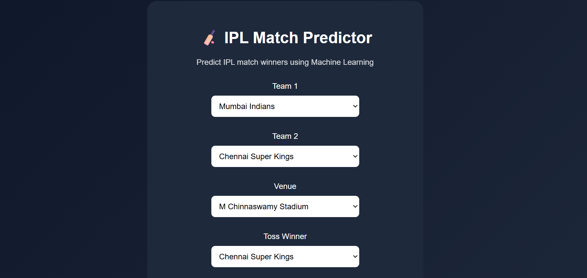
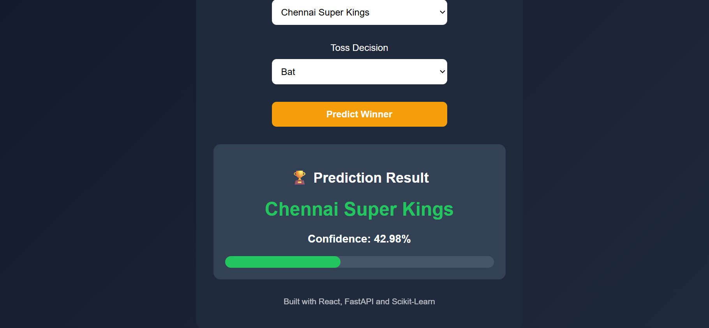

# 🏏 IPL Match Predictor

A full-stack Machine Learning web application that predicts the winner of an IPL match using historical IPL data and match-specific features such as teams, venue, toss winner, and toss decision.

## 🚀 Features

* Predicts IPL match winners using a trained Machine Learning model
* Confidence score visualization for each prediction
* Interactive React-based user interface
* FastAPI-powered backend prediction service
* Dropdown-based team and venue selection
* Validation to prevent invalid match inputs
* Real-time prediction generation

---

## 🛠️ Tech Stack

### Frontend

* React.js
* Vite
* Axios

### Backend

* FastAPI
* Python

### Machine Learning

* Scikit-Learn
* Random Forest Classifier
* Pandas
* Joblib

---

## 📊 Machine Learning Pipeline

1. Historical IPL match data preprocessing
2. Feature engineering using:

   * Team 1
   * Team 2
   * Venue
   * Toss Winner
   * Toss Decision
3. Categorical feature encoding using One-Hot Encoding
4. Model training using Random Forest Classifier
5. Model serialization using Joblib
6. Deployment through FastAPI REST APIs

---

## 📂 Project Structure

```bash
IPL-Match-Predictor
│
├── backend
│   ├── main.py
│   ├── train_model.py
│   ├── model
│   │   └── match_predictor.pkl
│   └── requirements.txt
│
├── frontend
│   ├── src
│   ├── public
│   └── package.json
│
├── data
│   └── matches.csv
│
├── screenshots
│
└── README.md
```

---

## ⚙️ Installation

### Clone Repository

```bash
git clone https://github.com/Sanjesh-v/ipl-match-predictor.git
cd ipl-match-predictor
```

### Backend Setup

```bash
cd backend

python -m venv .venv

# Windows
.venv\Scripts\activate

pip install -r requirements.txt

uvicorn main:app --reload
```

Backend runs at:

```text
http://127.0.0.1:8000
```

---

### Frontend Setup

```bash
cd frontend

npm install

npm run dev
```

Frontend runs at:

```text
http://localhost:5173
```

---

## 📈 Model Features

The prediction model considers:

* Team 1
* Team 2
* Venue
* Toss Winner
* Toss Decision

to estimate the most likely winner of an IPL match.

---

## 📸 Screenshots





## 🎯 Future Improvements

* Head-to-head team statistics
* Recent team form analysis
* Player performance integration
* Advanced ensemble models
* Live match prediction support
* Cloud deployment

---

## 👨‍💻 Author

**Sanjesh V**

GitHub: https://github.com/Sanjesh-v
